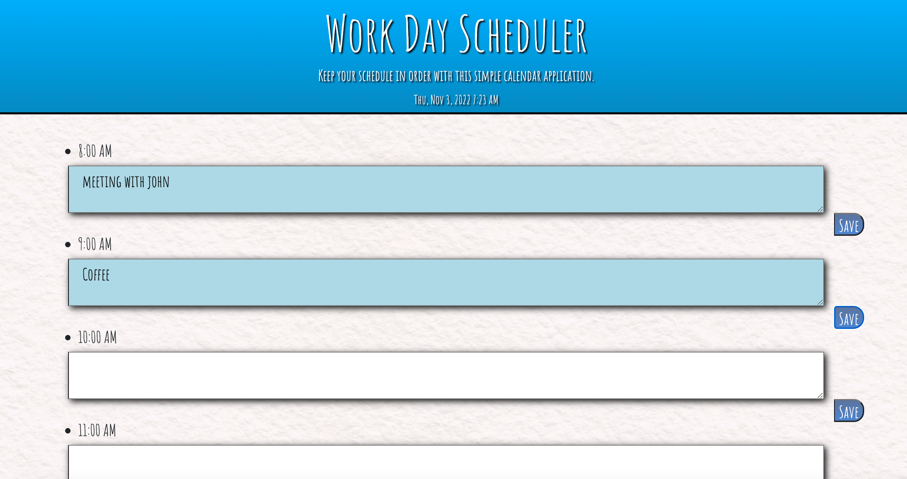

# 05 Third-Party APIs: Work Day Scheduler

## Description

An easy yet effective way to organize your daily work schedule.

## Authors

-Luke Mickan 
- https://github.com/Lmickk2

## Usage

- Click on a given time box
- Input tasks that need to be done
- Click the save icon located to the right of each box.

## Version History

    * Initial Release

## License

This project is licensed under the MIT License - see the LICENSE.md file for details